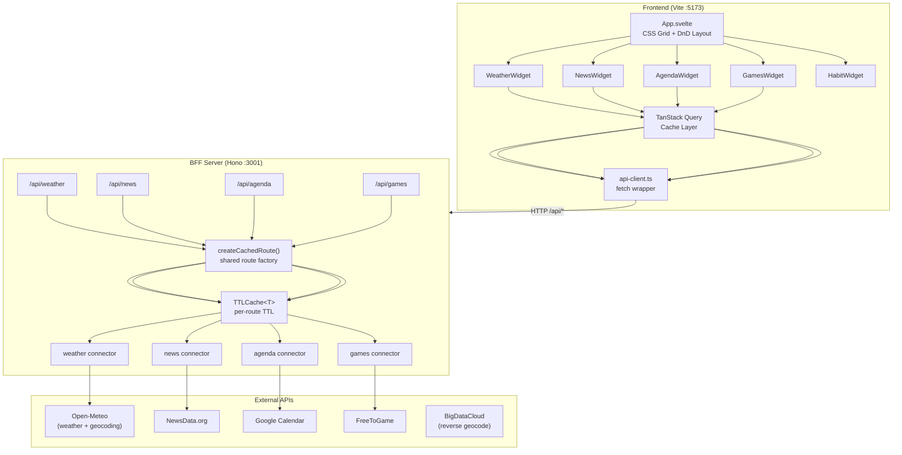
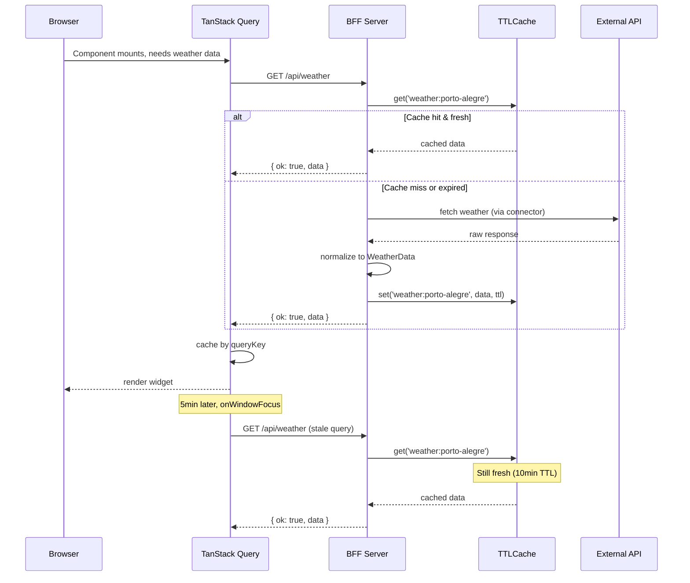

# Dashboard Architecture

## Overview

Monorepo with four packages sharing a TypeScript type layer. The **frontend** (Svelte 5 + Vite) renders five independent widgets. The **BFF server** (Hono) proxies external APIs, normalizes responses, and caches. The **shared** package defines the type contract between them.



## Package Structure

```
dashboard/
├── packages/
│   ├── shared/              # @dashboard/shared
│   │   └── src/
│   │       ├── index.ts           # barrel exports
│   │       ├── result.ts          # ApiResult<T>, ok(), err(), isOk(), isErr()
│   │       ├── api-types.ts       # WeatherData, NewsData, AgendaData, FreeGamesData
│   │       ├── query-keys.ts      # TanStack Query key factories
│   │       └── weather-codes.ts   # WMO code→description + icon mapping
│   │
│   ├── eslint-config/       # @dashboard/eslint-config
│   │   ├── index.mjs        # Base TS strict config
│   │   └── svelte.mjs       # Base + Svelte rules
│   │
│   ├── server/              # Hono BFF
│   │   └── src/
│   │       ├── index.ts           # App entry, CORS, route mounting, mock gate
│   │       ├── cache.ts           # TTLCache<T> in-memory with configurable TTL
│   │       ├── mock-data.ts       # Mock fixtures, gated by MOCK=true env
│   │       ├── lib/
│   │       │   └── google-auth.ts # OAuth2 token refresh for Google Calendar
│   │       ├── adapters/          # Fetcher interfaces + mock implementations
│   │       │   ├── index.ts       # re-exports all fetcher types + mocks
│   │       │   ├── weather.ts     # WeatherFetcher interface, mockWeatherFetcher
│   │       │   ├── news.ts
│   │       │   ├── agenda.ts
│   │       │   └── games.ts
│   │       ├── connectors/        # External API adapters (real fetch + normalize)
│   │       │   ├── weather.ts     # Open-Meteo geocoding + forecast
│   │       │   ├── news.ts
│   │       │   ├── agenda.ts      # Google Calendar with OAuth token
│   │       │   └── games.ts
│   │       └── routes/            # Hono route handlers per domain
│   │           ├── cached-route.ts # createCachedRoute() — shared factory
│   │           ├── weather.ts
│   │           ├── news.ts
│   │           ├── agenda.ts
│   │           └── games.ts
│   │
│   └── frontend/            # Svelte 5 + Vite
│       └── src/
│           ├── App.svelte           # Root layout, DnD grid, QueryClientProvider
│           ├── main.ts              # App mount + global CSS
│           ├── app.css              # Tailwind v4 + dark variant
│           ├── lib/
│           │   ├── api-client.ts    # Centralized HTTP client (GET/POST per route)
│           │   ├── query-client.ts  # TanStack QueryClient config
│           │   ├── query-config.ts  # Source config (staleTime, refetchInterval)
│           │   ├── theme.svelte.ts  # Dark/light theme store (Svelte runes)
│           │   ├── layout-store.ts  # Widget order + size (compact/wide)
│           │   ├── habit-store.ts   # Client-side habit state (localStorage)
│   │   ├── utils.ts         # cn() (clsx + tailwind-merge), formatTimeAgo()
│           │   ├── geolocation.ts   # Browser Geolocation API wrapper
│           │   ├── location-cache.ts # localStorage cache for coords
│           │   ├── reverse-geocode.ts # BigDataCloud reverse geocoding
│           │   └── weather-location.ts # Location resolution chain
│           ├── components/
│           │   ├── WidgetCard.svelte  # Widget shell: header, spinner, error, DnD, resize
│           │   └── ThemeToggle.svelte # Dark/light toggle button
│           └── widgets/
│               ├── weather/  # WeatherWidget (geolocation + Open-Meteo)
│               ├── news/     # NewsWidget (filterable)
│               ├── agenda/   # AgendaWidget (Google Calendar)
│               ├── games/    # GamesWidget (filterable + paginated)
│               └── habits/   # HabitWidget (client-side only, localStorage)
```

## Key Design Decisions

| Decision | Choice | Rationale |
|---|---|---|
| Monorepo | pnpm workspaces | Single install, shared types, single dev command |
| Types | ApiResult&lt;T&gt; discriminated union | Forces error handling at every level, TypeScript exhaustiveness |
| BFF cache | `createCachedRoute()` factory + per-route TTL | DRY route creation, each route owns its TTL via env vars |
| Mock data | `MOCK=true` env gate + adapter interfaces | Connectors are real code; adapters swap mock↔live fetchers |
| Widget contract | &lt;WidgetCard&gt; wrapper with Snippets | Consistent shell, widgets only render their data |
| Layout | svelte-dnd-action + layoutStore | User-reorderable grid with compact/wide toggle per widget |
| Habits | Client-side only (localStorage) | No server round-trip needed; reducer pattern for state |
| Weather location | Geolocation → reverse geocode → IP fallback → default | Progressive enhancement, 7-day cache in localStorage |
| Theme | Dark/light via CSS class on &lt;html&gt; | Tailwind v4 `dark:` variant, persisted to localStorage |
| Dev experience | `pnpm dev` → concurrently runs both | Single command, Vite proxy avoids CORS |

## Caching Strategy



### Cache keys

Cache keys are scoped by source + params. For weather, the key includes coordinates or location name (`weather:40.71:-74.01` or `weather:porto-alegre`). This means the same widget can cache multiple locations simultaneously.

## Refresh TTLs

| Source | Frontend staleTime | Frontend refetchInterval | BFF cache TTL (env var) |
|---|---|---|---|
| Weather | 5 min | 10 min | 10 min (`CACHE_TTL_WEATHER`) |
| News | 15 min | 30 min | 30 min (`CACHE_TTL_NEWS`) |
| Agenda | 5 min | 10 min | 10 min (`CACHE_TTL_AGENDA`) |
| Games | 60 min | 2 hours | 2 hours (`CACHE_TTL_GAMES`) |
| Habits | — | — | — (client-side only) |
