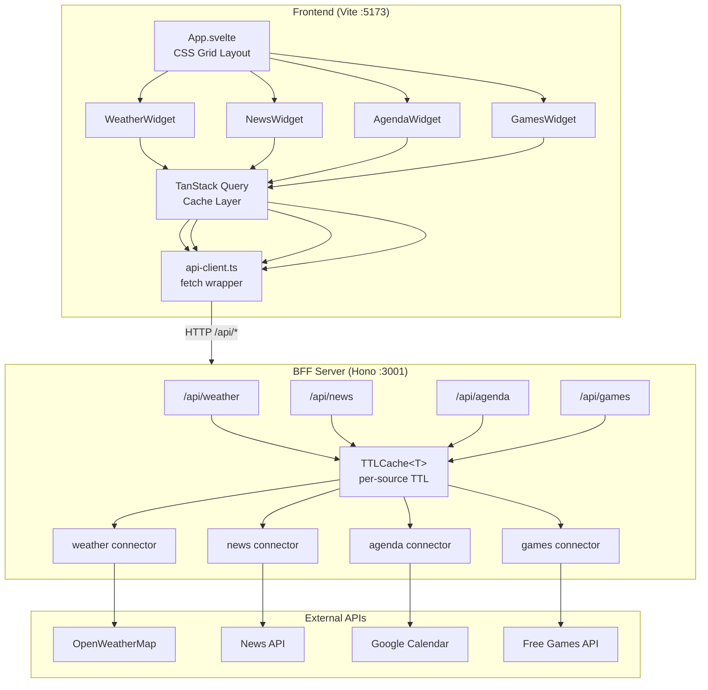
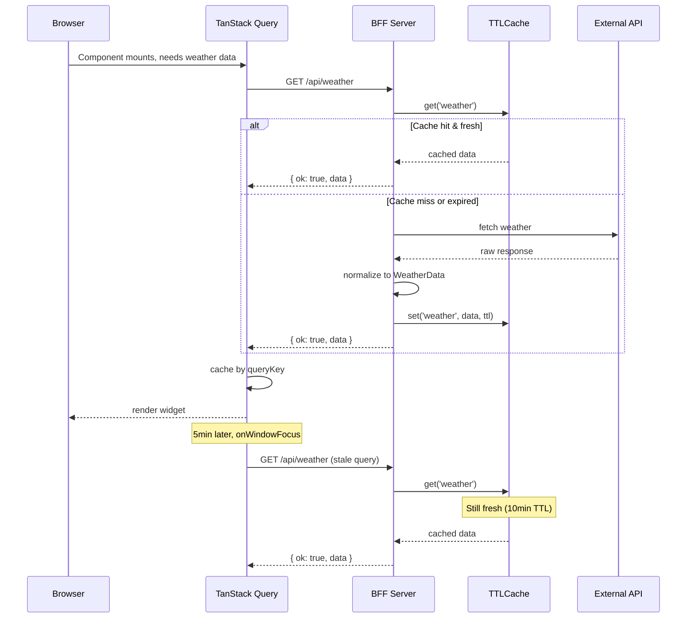

# Dashboard Architecture

## Overview

Monorepo with three packages sharing a TypeScript type layer. The **frontend** (Svelte 5 + Vite) renders four independent widgets. The **BFF server** (Hono) proxies external APIs, normalizes responses, and caches. The **shared** package defines the type contract between them.



## Package Structure

```
dashboard/
├── packages/
│   ├── shared/              # @dashboard/shared
│   │   └── src/
│   │       ├── result.ts    # ApiResult<T>, ok(), err(), isOk(), isErr()
│   │       ├── api-types.ts # WeatherData, NewsData, AgendaData, FreeGamesData
│   │       └── query-keys.ts # TanStack Query key factories
│   │
│   ├── eslint-config/       # @dashboard/eslint-config
│   │   ├── index.mjs        # Base TS strict config
│   │   └── svelte.mjs       # Base + Svelte rules
│   │
│   ├── server/              # Hono BFF
│   │   └── src/
│   │       ├── index.ts     # App entry, CORS, route mounting
│   │       ├── cache.ts     # TTLCache<T> in-memory with configurable expiration
│   │       ├── mock-data.ts # Mock fixtures, gated by MOCK=true env
│   │       ├── routes/      # Hono route handlers per domain
│   │       └── connectors/  # External API adapters (one per source)
│   │
│   └── frontend/            # Svelte 5 + Vite
│       └── src/
│           ├── App.svelte           # Root layout, theme init, QueryClientProvider
│           ├── main.ts              # App mount + global CSS
│           ├── app.css              # Tailwind v4 + dark variant
│           ├── lib/
│           │   ├── api-client.ts    # Centralized HTTP client
│           │   ├── query-client.ts  # TanStack QueryClient config
│           │   ├── theme.svelte.ts  # Dark/light theme store (Svelte runes)
│           │   └── utils.ts         # cn() helper (clsx + tailwind-merge)
│           ├── components/
│           │   ├── WidgetCard.svelte  # Widget shell: header, spinner, error, refresh
│           │   └── ThemeToggle.svelte # Dark/light toggle button
│           └── widgets/
│               ├── weather/  # WeatherWidget + useWeatherQuery
│               ├── news/     # NewsWidget + useNewsQuery
│               ├── agenda/   # AgendaWidget + useAgendaQuery
│               └── games/    # GamesWidget + useGamesQuery
```

## Key Design Decisions

| Decision | Choice | Rationale |
|---|---|---|
| Monorepo | pnpm workspaces | Single install, shared types, single dev command |
| Types | ApiResult&lt;T&gt; discriminated union | Forces error handling at every level, TypeScript exhaustiveness |
| BFF cache | per-source TTL (2x frontend staleTime) | Safety net under TanStack Query without rate-limit risk |
| Mock data | `MOCK=true` env gate | Works immediately out of the box, connectors are real code |
| Widget contract | &lt;WidgetCard&gt; wrapper with slots | Consistent shell, widgets only render their data |
| Theme | Dark/light via CSS class on &lt;html&gt; | Tailwind v4 `dark:` variant, persisted to localStorage |
| Dev experience | `pnpm dev` → concurrently runs both | Single command, Vite proxy avoids CORS |

## Caching Strategy



## Refresh TTLs

| Source | Frontend staleTime | Frontend refetchInterval | BFF cache TTL |
|---|---|---|---|
| Weather | 5 min | 10 min | 10 min |
| News | 15 min | 30 min | 30 min |
| Agenda | 5 min | 10 min | 10 min |
| Games | 60 min | 2 hours | 2 hours |
