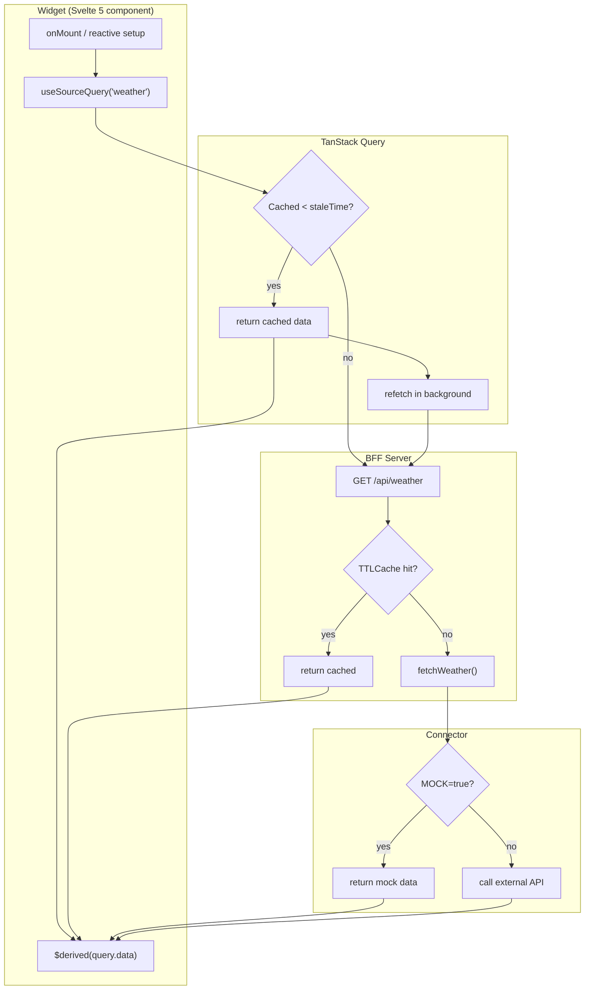
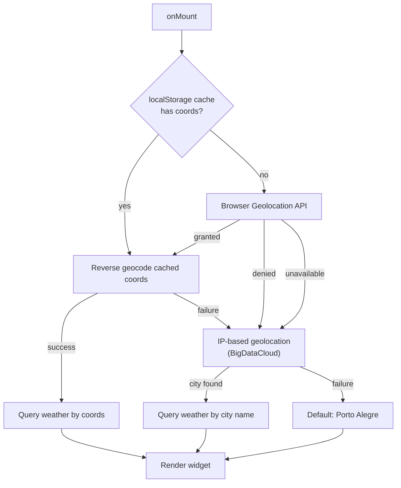
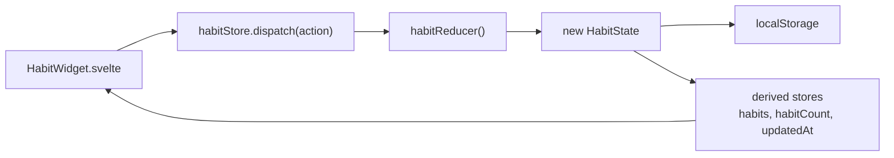
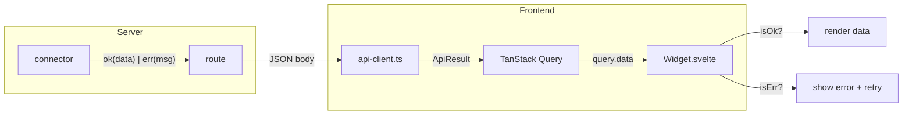

# Data Flow

## Request lifecycle

All server-backed widgets follow the same data flow. The architecture guarantees that one failing API never blocks the rest of the dashboard.



## Weather location resolution

The weather widget has a unique location resolution chain that runs before the query:



Location is cached in localStorage for 7 days. The "Use my location" button re-triggers the full chain.

## Habits — client-side only

Habits skip the entire server layer. State lives in localStorage, managed by a reducer:



No TanStack Query, no BFF, no network requests. The widget always renders instantly.

## Error propagation

All server layers use `ApiResult<T>` from `@dashboard/shared`. Errors propagate as values, not exceptions.



### ApiResult type

```ts
type ApiResult<T> =
  | { ok: true; data: T }
  | { ok: false; error: string };
```

The consumer pattern in every widget:

```svelte
<script lang="ts">
  const data = $derived(query.data);
</script>

{#if data && isOk(data)}
  <!-- render data.data -->
{:else if data && !isOk(data)}
  <!-- render data.error with retry button -->
{/if}
```

## Parallel loading

All six queries fire simultaneously on page load (habits resolves instantly from localStorage). TanStack Query handles request deduplication, so even if two widgets query the same source, only one request reaches the BFF.

```mermaid
gantt
    title Dashboard load timeline
    dateFormat X
    axisFormat %s

    section Weather widget
    Skeleton render       :a1, 0, 1
    Query fetch           :a2, 1, 5
    Data render           :a3, 5, 6

    section News widget
    Skeleton render       :b1, 0, 1
    Query fetch           :b2, 1, 8
    Data render           :b3, 8, 9

    section Agenda widget
    Skeleton render       :c1, 0, 1
    Query fetch           :c2, 1, 4
    Data render           :c3, 4, 5

    section Games widget
    Skeleton render       :d1, 0, 1
    Query fetch           :d2, 1, 3
    Data render           :d3, 3, 4

    section Habits widget
    Instant render        :e1, 0, 1
```



## Refresh triggers

| Trigger | Mechanism | Behavior |
|---|---|---|
| Page load | Initial render | Fires all 4 server queries in parallel; habits loads from localStorage |
| Window focus | `refetchOnWindowFocus: true` | Refetches only stale queries |
| Timer | `refetchInterval` per source | Polls time-sensitive sources (weather, agenda) |
| Manual | Refresh button per widget | Bypasses TanStack cache, hits BFF `/refresh` endpoint |
| Alt+click | Alt + refresh button | Clears BFF cache for that source, forces fresh fetch |

## Query configuration

Source query options (staleTime, refetchInterval, queryKey, queryFn) are defined in each widget's `manifest.ts` and collected by `widget-registry.ts`. The `useSourceQuery(name)` function in `query-config.ts` creates a TanStack Query with the right config, importing `sourceConfigs` from the registry. Weather has a special override in `query-config.ts` for coordinate-based queries.
