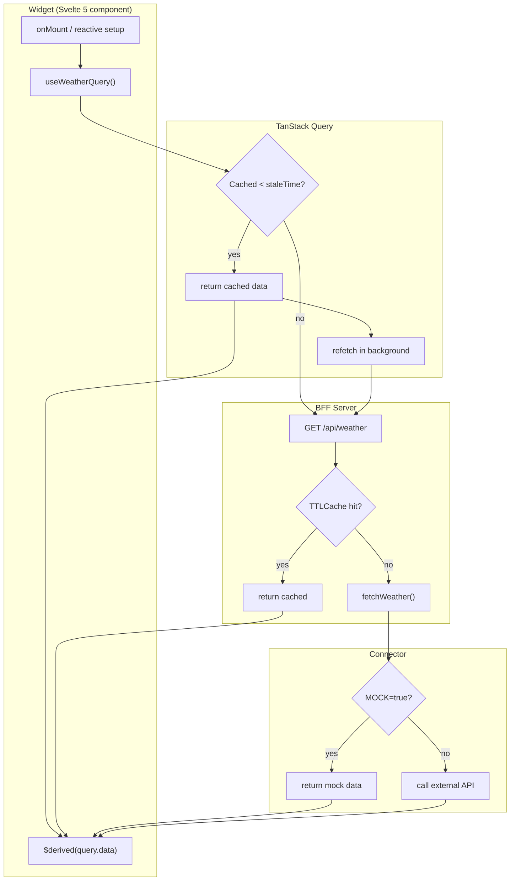
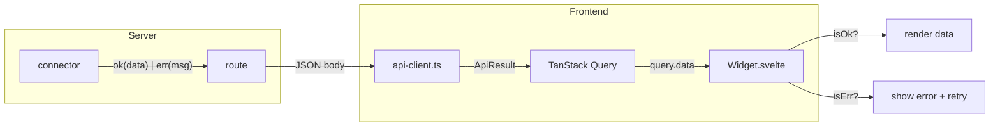

# Data Flow

## Request lifecycle

Every widget follows the same data flow. The architecture guarantees that one failing API never blocks the rest of the dashboard.



## Error propagation

All layers use `ApiResult<T>` from `@dashboard/shared`. Errors propagate as values, not exceptions.



### ApiResult type

```ts
type ApiResult<T> = 
  | { ok: true; data: T }
  | { ok: false; error: string };
```

The consumer pattern in every widget:

```svelte
<script lang="ts">
  const data = $derived(query.data);
</script>

{#if data && isOk(data)}
  <!-- render data.data -->
{:else if data && !isOk(data)}
  <!-- render data.error with retry button -->
{/if}
```

## Parallel loading

All four queries fire simultaneously on page load. TanStack Query handles request deduplication, so even if two widgets query weather, only one request reaches the BFF.

```mermaid
gantt
    title Dashboard load timeline
    dateFormat X
    axisFormat %s

    section Weather widget
    Skeleton render       :a1, 0, 1
    Query fetch           :a2, 1, 5
    Data render           :a3, 5, 6

    section News widget
    Skeleton render       :b1, 0, 1
    Query fetch           :b2, 1, 8
    Data render           :b3, 8, 9

    section Agenda widget
    Skeleton render       :c1, 0, 1
    Query fetch           :c2, 1, 4
    Data render           :c3, 4, 5

    section Games widget
    Skeleton render       :d1, 0, 1
    Query fetch           :d2, 1, 3
    Data render           :d3, 3, 4
```



## Refresh triggers

| Trigger | Mechanism | Behavior |
|---|---|---|
| Page load | Initial render | Fires all 4 queries in parallel |
| Window focus | `refetchOnWindowFocus: true` | Refetches only stale queries |
| Timer | `refetchInterval` per source | Polls time-sensitive sources (weather, agenda) |
| Manual | Refresh button per widget | Bypasses TanStack cache, forces BFF refresh |
