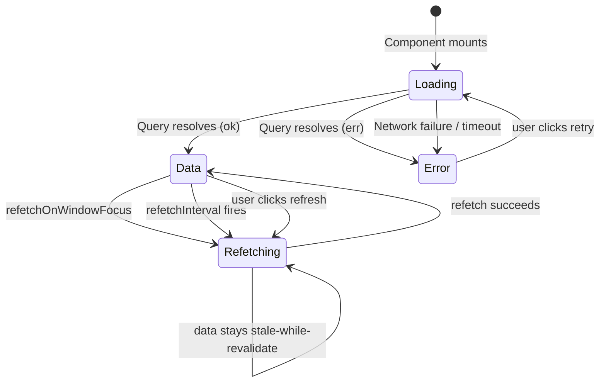
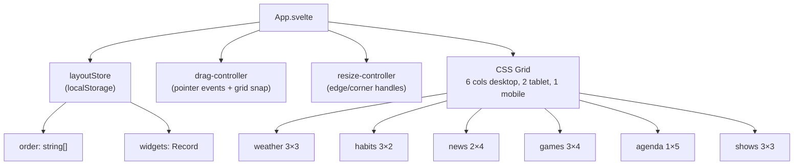
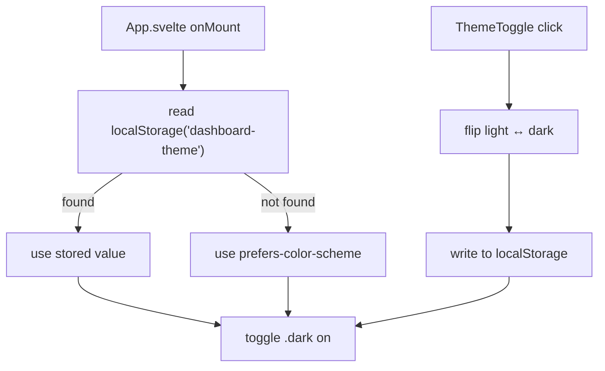

# Widget Lifecycle & Component Contract

## Widget states

Every server-backed widget passes through four states. The `<WidgetCard>` wrapper handles the shell; the widget content handles the data display. Habits is always instant (no loading state).



## WidgetCard contract

```
┌──────────────────────────────────────┐
│  [drag] [expand] [icon] Title [refresh] │  ← header: always visible
├──────────────────────────────────────┤
│                                      │
│  [loading]    spinner centered       │  ← isLoading = true
│                                      │
│  ── OR ──                            │
│                                      │
│  [error]      error msg + retry btn  │  ← error != ''
│                                      │
│  ── OR ──                            │
│                                      │
│  [data]       children rendered      │  ← children snippet
│              [bg-spinner]            │  ← isFetching indicator
│              [updated X ago]         │  ← updatedAt timestamp
│                                      │
└──────────────────────────────────────┘
```

### Props

```ts
interface WidgetCardProps {
  title: string;              // Widget title in the header
  icon?: Snippet;             // Icon slot in the header (Lucide icon)
  isLoading: boolean;         // Full spinner overlay, hides children
  isFetching: boolean;        // Subtle background refetch indicator
  error: string;              // Error message, shows retry UI when set
  onRefresh: (opts?: { clear?: boolean }) => void;  // Header refresh button; Alt+click passes { clear: true }
  children: Snippet;          // The widget's data content
  updatedAt?: string;         // ISO timestamp, shows "Updated X ago"
  class?: string;             // Extra classes for the outer card
}
```

### Usage pattern

```svelte
<script lang="ts">
  const query = useSourceQuery('weather');
  const data = $derived(query.data);
  const error = $derived(data && !isOk(data) ? data.error : '');
</script>

<WidgetCard
  title="Weather"
  isLoading={query.isLoading}
  isFetching={query.isFetching}
  error={error}
  onRefresh={handleRefresh}
  updatedAt={updatedAt}
>
  {#snippet icon()}
    <CloudSun class="h-4 w-4" />
  {/snippet}
  {#snippet children()}
    {#if data && isOk(data)}
      <!-- render data.data -->
    {/if}
  {/snippet}
</WidgetCard>
```

## Layout system

Widgets live in a CSS Grid (6 columns on desktop, 2 on tablet, 1 on mobile). Each widget has a `{ col, row, colSpan, rowSpan }` position stored in `layoutStore` and persisted to localStorage. Widgets can be dragged to repositioned and resized via edge/corner handles.



### Key files

- `widget-registry.ts` — collects all widget manifests, exports `COMPONENTS`, `sourceConfigs`, `WIDGET_IDS`, `DEFAULT_WIDGET_LAYOUTS`
- `layout-store.ts` — Svelte store with `updatePosition(id, pos)`, `reorder(newOrder)`, `getPosition(id)`, `getOrder()`. Persisted to localStorage.
- `drag-controller.svelte.ts` — composable for drag-and-drop with grid snapping and collision avoidance
- `resize-controller.svelte.ts` — composable for edge/corner resize with collision checking
- `responsive-layout.ts` — `computeResponsivePositions()` for mobile/tablet breakpoints
- `App.svelte` — thin orchestrator that composes the above modules and renders the widget grid

## Adding a new widget

1. Define the API type in `packages/shared/src/api-types.ts`
2. Add a query key in `packages/shared/src/query-keys.ts`
3. Create a connector in `packages/server/src/connectors/`
4. Add mock data in `packages/server/src/mock-data.ts`
5. Create a route in `packages/server/src/routes/`
6. Mount the route in `packages/server/src/index.ts`
7. Add fetch functions in `packages/frontend/src/lib/api-client.ts`
8. Create `packages/frontend/src/widgets/<name>/` with:
   - `<Name>Widget.svelte` — the widget component
   - `manifest.ts` — exports a `WidgetManifest` with id, component, queryKey, queryFn, refreshFn, staleTime, refetchInterval, defaultLayout

The `widget-registry.ts` auto-collects all manifests. No other files need editing.

### Client-only widgets (no server)

For widgets that don't need server data (like Habits), skip steps 1–7. The manifest omits `queryKey`/`queryFn`/`refreshFn`/`staleTime`/`refetchInterval`:

```ts
import type { WidgetManifest } from '@dashboard/shared';
import HabitWidget from './HabitWidget.svelte';

export const manifest: WidgetManifest = {
  id: 'habits',
  component: HabitWidget,
  defaultLayout: { col: 3, row: 0, colSpan: 3, rowSpan: 2 },
};
```

## Testing per widget

| Layer | What to test | Tool | Example |
|---|---|---|---|
| `shared/result.ts` | ok/err construction, isOk/isErr narrowing, unwrap | Vitest | `tests/result.test.ts` |
| `server/cache.ts` | TTL expiry, get/set/delete/clear, per-entry TTL | Vitest | `tests/cache.test.ts` |
| `server/connectors/*` | Normalization logic with mock data | Vitest (future) | Skip in boilerplate |
| Frontend widgets | Visual inspection during dev | Manual | Run dev server |

## Theme



The theme is applied via a CSS class on `<html>`. Tailwind v4's `@custom-variant dark` declaration enables `dark:` prefix variants. The `ThemeToggle` component reads from and writes to the `themeStore` (a Svelte 5 rune-based store in `theme.svelte.ts`).
